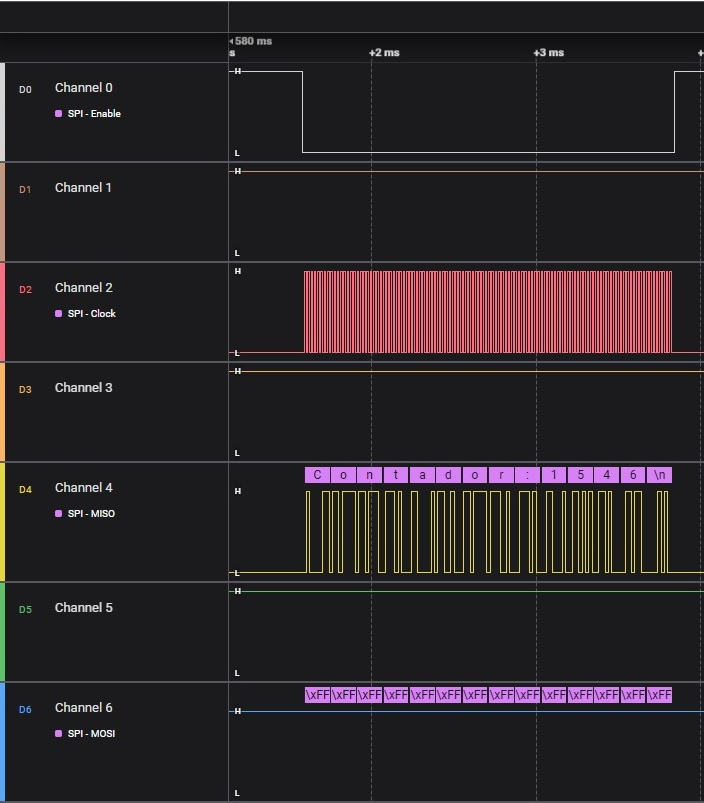

# Ejemplo de configuracion del puerto SPI en microcontrolador ESP32
El ESP32 tiene 4 host SPI, pero solo el SPI1 y SPI2 están completamente disponibles para el usuario. SPI0 /SPI1 se utilizan para manejar la memoria flash externa del ESP32.

## Ejemplo SPI master

En este ejemplo vamos a configurar el HOST SPI3_HOST en modo master. Para realizar esto tenemos que seguir dos pasos:
- Configurar el bus spi
- Agregar nuestro dispositivo al bus

### Configurar el bus spi

Un HOST puede ser compartido hasta por múltiples dispositivos. Todos estos dispositivos estaran conectados al mismo bus. Para inicializar un bus debemos usar la estructura de datos `spi_device_interface_config_t`. En este ejemplo realizamos la siguiente configuración:

```
#define SPI_MISO             (25)
#define SPI_MOSI             (23)
#define SPI_SDA              (22)
#define SPI_SCK              (19)
#define NOT_USE_PIN          (-1)
#define SPI_HOST             (SPI3_HOST)


spi_bus_config_t bus_config = {
    .miso_io_num   = SPI_MISO,
    .mosi_io_num   = SPI_MOSI,
    .sclk_io_num   = SPI_SCK,
    .quadwp_io_num = NOT_USE_PIN,
    .quadhd_io_num = NOT_USE_PIN
};
```


### Agregar el dispositivo al bus
Una vez inicializado el bus podemos agregar un dispositivo. En este ejemplo solo transmito datos en modo master. Para configurar y agregar un dispositivo uso la estructura `spi_device_interface_config_t`. La configuracion utilizada en este ejemplo es la siguiente. Se recomienda no superar los 26Mhz en configuraciones simples como la utilizada aqui. Para poder ver la señal en un analizador lógico se utilizo 0,5Mhz.

```

spi_device_interface_config_t dev_config ={
    .clock_speed_hz = 50000,
    .mode = 0,
    .clock_source = SPI_CLK_SRC_DEFAULT, //
    .spics_io_num = SPI_SDA,
    .queue_size = 10,
    .pre_cb = tr_pre,
    .post_cb=tr_pos,
    .flags = SPI_DEVICE_NO_DUMMY
    };

```

Después de configurar el dispositivo ya podemos comenzar a enviar buffer de datos por el bus, pero para hacerlo tenemos que utilizar la interfaz `spi_transaction_t`. En nuestro ejemplo enviamos un buffer de len elementos.
```
   uint8_t buffer[]="Contador: %lu\n";
   size_t len = strlen(buffer); // el numero de chars de buffer
   spi_transaction_t tr = {
        .flags  = 0x00, // sin opciones extra
        .length = len,
        .tx_buffer = buffer
    };
    spi_device_transmit(_device,&tr);

```

### Imágenes de las tramas de datos transmitidas usando Analizador Lógico.

